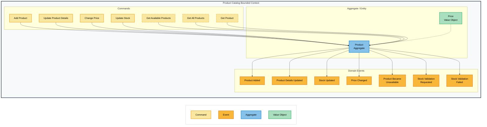
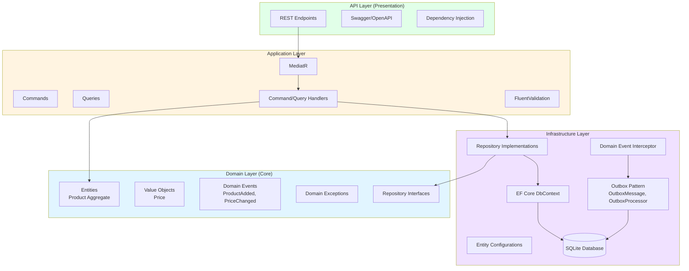
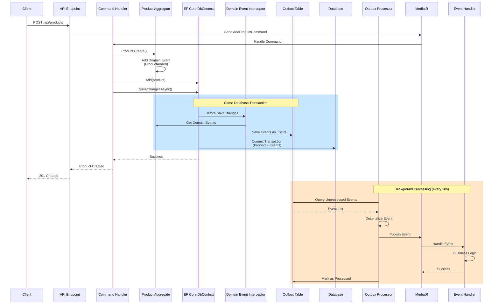

# Online Shop - Domain Driven Design Learning Project


> A professional implementation of Domain-Driven Design principles with Clean Architecture, CQRS, and Event-Driven Architecture patterns using .NET 8

## Project Overview

This is a continuously growing learning project implementing a complete online shop using Domain-Driven Design and Clean Architecture. Currently, the Product Catalog Bounded Context is implemented, with additional contexts planned incrementally.

## Event Storming & Domain Design

This project was developed using Event Storming methodology to identify domain events, commands, and aggregates:



The Event Storming session identified the following key elements:
- **Commands**: User actions that trigger domain changes
- **Domain Events**: Business facts that have occurred
- **Aggregate**: Product as the main domain object
- **Value Objects**: Price for encapsulated business logic

### Bounded Contexts Roadmap

- ✅ **Product Catalog** - Product management (Currently implemented)
- 🔄 **Shopping Basket** - Shopping cart functionality (Planned)
- 🔄 **Checkout Process** - Order processing (Planned)
- 🔄 **Payment** - Payment processing (Planned)
- 🔄 **Fulfillment** - Shipping and delivery (Planned)

## Architecture

### Clean Architecture Overview

The project follows Clean Architecture principles with clear separation of concerns across four layers:



### Layer Responsibilities

- **Domain Layer**: Entities, Value Objects, Domain Events, Domain Exceptions - Pure business logic with no dependencies
- **Application Layer**: Use Cases, Commands, Queries, Handlers (CQRS) - Orchestrates domain objects
- **Infrastructure Layer**: Database, Repository Implementations, Event Processing - External concerns
- **API Layer**: HTTP Endpoints, Dependency Injection Setup - Entry point for external requests

### Implemented DDD Patterns

- **Aggregate Root**: Product as aggregate with invariant protection
- **Value Objects**: Price as immutable value object
- **Domain Events**: Event-based communication between aggregates
- **Factory Method Pattern**: Controlled entity creation with validation
- **Repository Pattern**: Data access layer abstraction
- **Transactional Outbox Pattern**: Guaranteed event delivery

### Vertical Slice Architecture

Each feature is implemented as an independent "slice" with all necessary layers:

```
Features/AddProduct/
├── AddProductCommand.cs
├── AddProductCommandHandler.cs
├── AddProductCommandValidator.cs
└── AddProductEndpoint.cs
```

## Domain Events Processing

The project implements the **Transactional Outbox Pattern** for guaranteed event delivery. This ensures that domain events are never lost, even in case of system failures.

### Event Flow with Outbox Pattern



### Key Benefits

- **Atomic Transactions**: Events are persisted in the same database transaction as domain changes
- **Guaranteed Delivery**: No lost events, even on system failures
- **Asynchronous Processing**: Events processed by background service without blocking API responses
- **Retry Mechanism**: Failed events are automatically retried by the outbox processor
- **Event Sourcing Ready**: Foundation for event-driven architecture

### Domain Events

The following domain events have been identified through Event Storming workshops:

- ✅ `ProductAdded` - New product added to catalog
- ✅ `PriceChanged` - Product price updated
- ✅ `StockUpdated` - Inventory level changed
- ✅ `ProductBecameUnavailable` - Product out of stock
- 🔄 `ProductDetailsUpdated` - Product information modified (Planned)
- 🔄 `StockValidationRequested` - Inventory validation triggered (Planned)
- 🔄 `StockValidationFailed` - Inventory validation failed (Planned)

## Technology Stack

### Backend (.NET 8)

- **Framework**: ASP.NET Core 8 Web API
- **Architecture**: Clean Architecture + DDD + Vertical Slice
- **CQRS**: MediatR for Command/Query Separation
- **Validation**: FluentValidation for input validation
- **ORM**: Entity Framework Core with SQLite
- **Domain Events**: MediatR with Transactional Outbox Pattern
- **Background Services**: .NET Hosted Services for event processing
- **API Documentation**: Swagger/OpenAPI with XML comments

### Patterns & Practices

- **Domain-Driven Design**: Aggregates, Value Objects, Domain Events
- **CQRS**: Command/Query Responsibility Segregation
- **Event-Driven Architecture**: Domain Events as first-class citizens
- **Transactional Outbox**: Atomic persistence with guaranteed event delivery
- **EF Core Interceptors**: Automatic event persistence
- **Factory Method Pattern**: Controlled object creation
- **Repository Pattern**: Clean data access abstraction
- **Specification Pattern**: Reusable query logic (Planned)

### Development Tools

- **Code Quality**: StyleCop for code standards
- **CI/CD**: GitHub Actions (Planned)
- **Code Analysis**: SonarCloud integration (Planned)
- **Testing**: xUnit, FluentAssertions, Moq

### Future Integrations

- **Service Discovery**: .NET Aspire
- **Event Bus**: RabbitMQ for distributed events
- **Caching**: Redis for performance optimization
- **Monitoring**: Observability with Aspire Dashboard

## Project Structure

```
src/ProductCatalog/
├── ProductCatalog.Api/              # HTTP Endpoints, Program.cs
│   ├── Endpoints/                   # Minimal API Endpoints
│   └── Extensions/                  # Endpoint mapping extensions
├── ProductCatalog.Application/      # Use Cases, Commands, Queries
│   ├── Features/                    # Vertical slices
│   │   ├── AddProduct/
│   │   ├── GetProducts/
│   │   └── UpdateProduct/
│   └── DependencyInjection.cs
├── ProductCatalog.Domain/           # Core business logic
│   ├── Common/                      # AggregateRoot, IDomainEvent
│   ├── Entities/                    # Product Aggregate
│   ├── Events/                      # Domain Events
│   ├── Exceptions/                  # Domain-specific Exceptions
│   └── ValueObjects/                # Price Value Object
├── ProductCatalog.Infrastructure/   # External concerns
│   ├── Persistence/
│   │   ├── Configurations/          # EF Core Entity Configurations
│   │   ├── Interceptors/            # Domain Event Interceptor
│   │   ├── Outbox/                  # Outbox Pattern Implementation
│   │   └── ProductCatalogDbContext.cs
│   ├── Repositories/                # Repository Implementations
│   └── DependencyInjection.cs
└── ProductCatalog.Tests/            # Unit & Integration Tests
```

## Quick Start

### Prerequisites

- .NET 8 SDK
- Git
- SQLite (included with .NET)

### Installation

```bash
# Clone repository
git clone https://github.com/lady-logic/OnlineShop.git
cd OnlineShop

# Restore dependencies
dotnet restore

# Create database and apply migrations
cd src/ProductCatalog/ProductCatalog.Api
dotnet ef database update --project ../ProductCatalog.Infrastructure

# Start API
dotnet run
```

### Testing the API

1. Open Swagger UI at `https://localhost:7xxx/swagger`
2. Test the AddProduct endpoint with sample data:

```json
{
  "name": "iPhone 15",
  "description": "Latest Apple smartphone",
  "priceAmount": 999.99,
  "currency": "EUR",
  "initialStock": 50
}
```

3. Verify the product was created with GET endpoint
4. Check the Outbox table to see persisted events

### Running Tests

```bash
# Run all tests
dotnet test

# Run with code coverage
dotnet test --collect:"XPlat Code Coverage"

# Run specific test project
dotnet test src/ProductCatalog/ProductCatalog.Tests
```

## API Documentation

The API is fully documented using Swagger/OpenAPI. All endpoints include:
- Detailed descriptions
- Request/response examples
- Validation rules
- HTTP status codes

Access the interactive documentation at `/swagger` when running the application.

## Learning Objectives

This project serves as a practical implementation for learning:

- ✅ Domain Driven Design (DDD) principles and tactical patterns
- ✅ Clean Architecture implementation
- ✅ CQRS Pattern with MediatR
- ✅ Event Storming as a design methodology
- ✅ Vertical Slice Architecture
- ✅ Transactional Outbox Pattern
- ✅ Domain Events processing with guaranteed delivery
- ✅ Factory Method Pattern for entity creation
- ✅ EF Core Interceptors for cross-cutting concerns
- ✅ Value Objects and Aggregate Roots
- 🔄 Event-Driven Architecture (in development)
- 🔄 Microservices communication patterns (planned)
- 🔄 .NET Aspire for service orchestration (planned)

## Current Status

**Current State**: Product Catalog Bounded Context with Domain Events and Outbox Pattern

**Next Steps**:
- Implement event handlers for business logic
- Expand query-side (CQRS read models)
- Add integration tests for event processing
- Implement additional product management features
- Add authentication and authorization

## Contributing

This is a learning project, but suggestions and feedback are welcome! Feel free to:
- Open issues for questions or suggestions
- Submit pull requests for improvements
- Share your own DDD learning experiences

## License

MIT License - see LICENSE file for details

## Acknowledgments

Built with guidance from DDD community resources and Event Storming methodologies.

---

**Note**: This is an educational project focused on learning DDD, Clean Architecture, and modern .NET development practices. It is continuously evolving as new concepts are explored and implemented.
