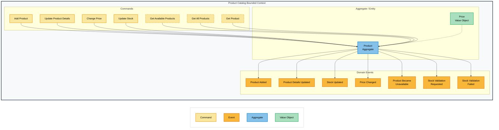
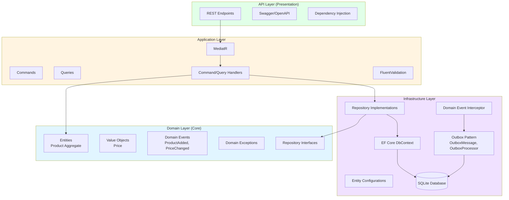
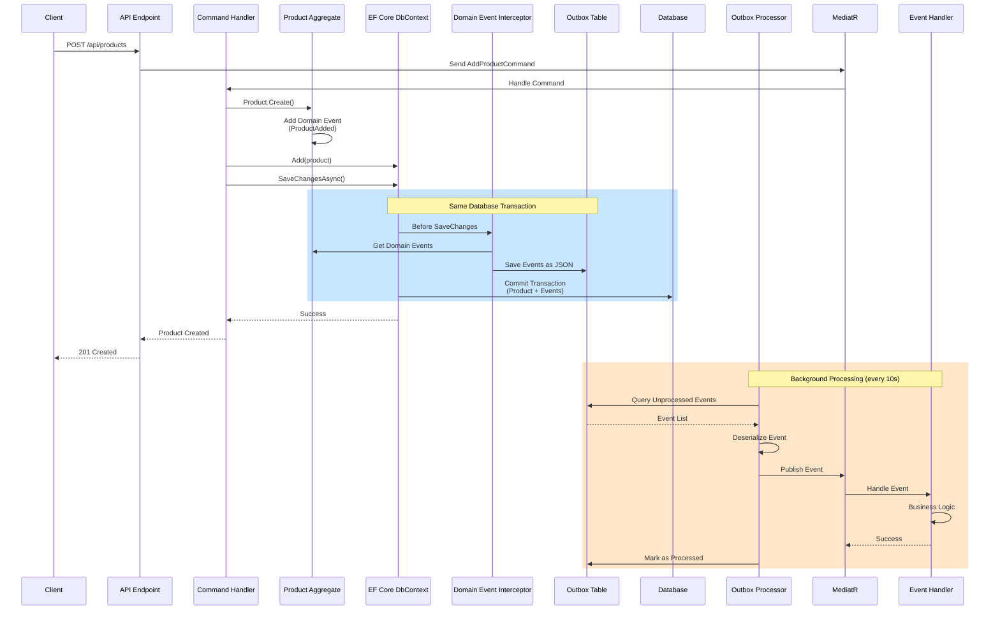

# Online Shop - Domain Driven Design Learning Project


> Eine professionelle Implementierung von Domain-Driven Design Prinzipien mit Clean Architecture, CQRS und Event-Driven Architecture in .NET 8

## Projektübersicht

Dieses kontinuierlich wachsende Lernprojekt implementiert einen vollständigen Online-Shop mit Domain-Driven Design und Clean Architecture. Aktuell ist der Product Catalog Bounded Context implementiert, weitere Kontexte folgen schrittweise.

## Event Storming & Domain Design

Dieses Projekt wurde mit Event Storming Methodik entwickelt, um Domain Events, Commands und Aggregates zu identifizieren:



Die Event Storming Session identifizierte folgende Schlüsselelemente:
- **Commands**: Benutzeraktionen, die Domain-Änderungen auslösen
- **Domain Events**: Geschäftsfakten, die eingetreten sind
- **Aggregate**: Product als Haupt-Domainenobjekt
- **Value Objects**: Price für gekapselte Geschäftslogik

### Bounded Contexts Roadmap

- ✅ **Product Catalog** - Produktverwaltung (Aktuell implementiert)
- 🔄 **Shopping Basket** - Warenkorb-Funktionalität (Geplant)
- 🔄 **Checkout Process** - Bestellabwicklung (Geplant)
- 🔄 **Payment** - Zahlungsabwicklung (Geplant)
- 🔄 **Fulfillment** - Versand und Lieferung (Geplant)

## Architecture

### Clean Architecture Overview

Das Projekt folgt Clean Architecture Prinzipien mit klarer Trennung der Zuständigkeiten über vier Schichten:



### Layer Responsibilities

- **Domain Layer**: Entities, Value Objects, Domain Events, Domain Exceptions - Reine Geschäftslogik ohne Abhängigkeiten
- **Application Layer**: Use Cases, Commands, Queries, Handler (CQRS) - Orchestrierung von Domänenobjekten
- **Infrastructure Layer**: Datenbank, Repository-Implementierungen, Event-Verarbeitung - Externe Belange
- **API Layer**: HTTP-Endpunkte, Dependency Injection Setup - Eingangspunkt für externe Anfragen

### Implementierte DDD-Patterns

- **Aggregate Root**: Product als Aggregate mit invarianten Schutz
- **Value Objects**: Price als immutable Value Object
- **Domain Events**: Event-basierte Kommunikation zwischen Aggregates
- **Factory Method Pattern**: Kontrollierte Entity-Erstellung mit Validation
- **Repository Pattern**: Abstraktion der Datenzugriffsschicht
- **Transactional Outbox Pattern**: Garantierte Event-Auslieferung mit Transaktionssicherheit

### Vertical Slice Architecture

Jedes Feature wird als unabhängiger "Slice" mit allen notwendigen Schichten implementiert:

```
Features/AddProduct/
├── AddProductCommand.cs
├── AddProductCommandHandler.cs
├── AddProductCommandValidator.cs
└── AddProductEndpoint.cs
```

## Domain Events Verarbeitung

Das Projekt implementiert das Transactional Outbox Pattern für garantierte Event-Zustellung. Dies stellt sicher, dass Domain Events niemals verloren gehen, selbst bei Systemausfällen.

### Event-Fluss mit Outbox Pattern



### Hauptvorteile

- **Atomic Transactions**: Events werden in derselben Datenbanktransaktion wie Domainänderungen persistiert
- **Guaranteed Delivery**: Keine verlorenen Events, selbst bei Systemausfällen
- **Asynchronous Processing**: Events werden durch Hintergrunddienste verarbeitet ohne API-Antworten zu blockieren
- **Retry Mechanism**: Fehlgeschlagene Events werden automatisch vom Outbox-Prozessor wiederholt
- **Event Sourcing Ready**: Grundlage für ereignisgesteuerte Architektur

### Domain Events

Folgende Domain Events wurden durch Event Storming Workshops identifiziert:

- ✅ `ProductAdded` - Neues Produkt zum Katalog hinzugefügt
- ✅ `PriceChanged` - Produktpreis aktualisiert
- ✅ `StockUpdated` - Bestandsmenge geändert
- ✅ `ProductBecameUnavailable` - Produkt nicht mehr verfügbar
- 🔄 `ProductDetailsUpdated` - Produktinformationen geändert (Geplant)
- 🔄 `StockValidationRequested` - Bestandsvalidierung ausgelöst (Geplant)
- 🔄 `StockValidationFailed` - Bestandsvalidierung fehlgeschlagen (Geplant)

## Technologie-Stack

### Backend (.NET 8)

- **Framework**: ASP.NET Core 8 Web API
- **Architektur**: Clean Architecture + DDD + Vertical Slice
- **CQRS**: MediatR für Command/Query Separation
- **Validierung**: FluentValidation für Input-Validierung
- **ORM**: Entity Framework Core mit SQLite
- **Domain Events**: MediatR mit Transactional Outbox Pattern
- **Message Broker**: MassTransit mit RabbitMQ für robuste Event-Verarbeitung
- **Background Services**: .NET Hosted Services für Event Processing
- **API Documentation**: Swagger/OpenAPI
- **Observability**: Serilog, OpenTelemetry, Prometheus, Grafan

### Patterns & Practices

- **Domain-Driven Design**: Aggregates, Value Objects, Domain Events
- **CQRS**: Command/Query Responsibility Segregation
- **Event Sourcing Ready**: Domain Events als First-Class Citizens
- **Transactional Outbox**: Atomare Persistenz mit garantierter Event-Auslieferung
- **Event Bus**: MassTransit für zuverlässige Bounded Context-Kommunikation
- **EF Core Interceptors**: Automatische Event-Persistierung
- **Factory Method Pattern**: Kontrollierte Objekterstellung
- **Repository Pattern**: Saubere Datenabstraktion

### Entwicklungstools

- **Code Quality**: StyleCop für Code-Standards
- **CI/CD**: GitHub Actions (Geplant)
- **Code Analysis**: SonarCloud Integration (Geplant)
- **Testing**: xUnit, FluentAssertions, Moq

### Zukünftige Integrationen
- **Service Discovery**: .NET Aspire (Geplant)
- **Caching**: Redis für Performance (Geplant)
- **Monitoring**: Observability mit Aspire (Geplant)

## Projektstruktur

```
src/ProductCatalog/
├── ProductCatalog.Api/              # HTTP Endpoints, Program.cs
│   ├── Endpoints/                   # Minimal API Endpoints
│   └── Extensions/                  # Endpoint mapping extensions
├── ProductCatalog.Application/      # Use Cases, Commands, Queries
│   ├── Features/                    # Vertical slices
│   │   ├── AddProduct/
│   │   ├── GetProducts/
│   │   └── UpdateProduct/
│   └── DependencyInjection.cs
├── ProductCatalog.Domain/           # Core business logic
│   ├── Common/                      # AggregateRoot, IDomainEvent
│   ├── Entities/                    # Product Aggregate
│   ├── Events/                      # Domain Events
│   ├── Exceptions/                  # Domain-specific Exceptions
│   └── ValueObjects/                # Price Value Object
├── ProductCatalog.Infrastructure/   # External concerns
│   ├── Persistence/
│   │   ├── Configurations/          # EF Core Entity Configurations
│   │   ├── Interceptors/            # Domain Event Interceptor
│   │   ├── Outbox/                  # Outbox Pattern Implementation
│   │   └── ProductCatalogDbContext.cs
│   ├── Repositories/                # Repository Implementations
│   └── DependencyInjection.cs
└── ProductCatalog.Tests/            # Unit & Integration Tests
```

## Schnellstart

### Voraussetzungen

- .NET 8 SDK
- Git
- Docker (für Container und Infrastruktur)

### Installation

### Lokale Entwicklung starten
```bash
# Repository klonen
git clone https://github.com/lady-logic/OnlineShop.git
cd OnlineShop

# Abhängigkeiten wiederherstellen
dotnet restore

# Datenbank erstellen und Migrationen anwenden
cd src/ProductCatalog/ProductCatalog.Api
dotnet ef database update --project ../ProductCatalog.Infrastructure

# API starten
dotnet run
```

### Mit Docker starten
```bash
# Repository klonen
git clone https://github.com/lady-logic/OnlineShop.git
cd OnlineShop

# Docker Container starten
docker-compose up -d
```

### API testen

1. Swagger UI unter `http://localhost:8080/swagger` öffnen
2. Den AddProduct-Endpunkt mit Beispieldaten testen:

```json
{
  "name": "iPhone 15",
  "description": "Latest Apple smartphone",
  "priceAmount": 999.99,
  "currency": "EUR",
  "initialStock": 50
}
```

3. Überprüfen, ob das Produkt mit dem GET-Endpunkt erstellt wurde
4. Die Outbox-Tabelle überprüfen, um persistierte Events zu sehen

### Services erreichen

- API & Swagger: http://localhost:8080/swagger
- RabbitMQ Management: http://localhost:15672 (Benutzername: guest, Passwort: guest)
- Prometheus: http://localhost:9090
- Grafana: http://localhost:3000 (Benutzername: admin, Passwort: password)

### Tests ausführen

```bash
# Run all tests
dotnet test

# Run with code coverage
dotnet test --collect:"XPlat Code Coverage"

# Run specific test project
dotnet test src/ProductCatalog/ProductCatalog.Tests
```

## API-Dokumentation

Die API ist vollständig mit Swagger/OpenAPI dokumentiert. Alle Endpunkte enthalten:
- Detaillierte Beschreibungen
- Request/Response-Beispiele
- Validierungsregeln
- HTTP-Statuscodes

Zugriff auf die interaktive Dokumentation unter `/swagger` beim Ausführen der Anwendung.

## Observability
Die Anwendung implementiert moderne Observability-Praktiken:

### Strukturiertes Logging mit Serilog

JSON-formatierte Logs für bessere Suchbarkeit und Analyse
Automatische Anreicherung mit Kontextinformationen (Maschinennamen, Thread-IDs, etc.)
Ausgabe in Konsole und Dateisystem

### Metriken mit OpenTelemetry und Prometheus

Automatische Erfassung von ASP.NET Core und HTTP-Client-Metriken
Benutzerdefinierte Domain-Event-Metriken (Verarbeitete Events, Fehlerrate, Verarbeitungszeit)
Speicherung in Prometheus Zeitreihen-Datenbank

### Tracing mit OpenTelemetry

Verteiltes Tracing über Service-Grenzen hinweg
Automatische Instrumentierung von ASP.NET Core und Entity Framework Core
Korrelation zwischen Logs, Metriken und Traces

### Visualisierung mit Grafana

Vorkonfigurierte Dashboards für API-Gesundheit und Domain-Event-Monitoring
Echtzeit-Überwachung der Anwendungsleistung
Anpassbare Alarme für wichtige Metriken

## Lernziele

Dieses Projekt dient der praktischen Umsetzung für das Erlernen von:

- ✅ Domain Driven Design (DDD) Prinzipien und taktischen Patterns
- ✅ Clean Architecture Implementierung
- ✅ CQRS Pattern mit MediatR
- ✅ Event Storming als Design-Methodik
- ✅ Vertical Slice Architecture
- ✅ Transactional Outbox Pattern
- ✅ Domain Events Verarbeitung
- ✅ Factory Method Pattern
- ✅ EF Core Interceptors
- ✅ Event-Driven Architecture mit MassTransit/RabbitMQ
- ✅ Moderne Observability-Praktiken (Serilog, OpenTelemetry)
- 🔄 Microservices-Kommunikation (geplant)
- 🔄 .NET Aspire für Service-Orchestrierung (geplant)

**Aktueller Stand**: Product Catalog Bounded Context mit Event Bus-Integration und vollständiger Observability
**Nächste Schritte**: Shopping Basket Bounded Context implementieren

**Hinweis**: Dies ist ein Lernprojekt zum Vertiefen von DDD, Clean Architecture und modernen .NET-Entwicklungspraktiken. Es entwickelt sich kontinuierlich weiter, während neue Konzepte erkundet und implementiert werden.
